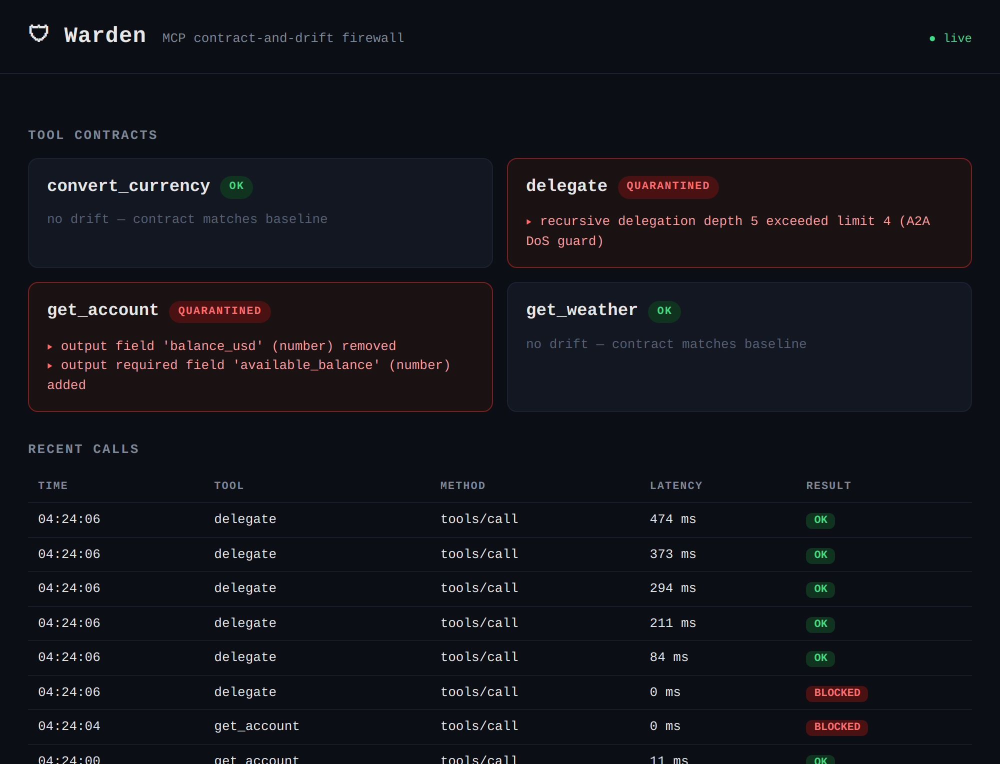

# 🛡 Warden — a contract-and-drift firewall for MCP tool fleets

**Warden is a transparent FastAPI reverse-proxy that sits between an MCP client (an agent) and a real MCP server, snapshotting every tool's JSON-schema contract and diffing each later run against the baseline. When a breaking change appears — a removed, renamed, retyped, or newly-required field — Warden flags the exact diff in plain language and _quarantines_ the tool at the proxy, so the downstream agent fails safe instead of silently hallucinating around a field that moved.**

---

## The gap it closes

An MCP server's tools are a contract. Agents build tool calls against that contract and read fields out of the results. When someone ships a change to a tool — renames an output field, tightens a required input — nothing tells the agent. It keeps calling, reads a field that is now gone, and **confidently reports a wrong answer**. In a fleet of MCP microservices evolving independently, this is a silent, compounding failure mode.

Warden makes the contract observable and enforceable at the boundary:

```text
        MCP client (the agent)
               │   JSON-RPC over Streamable HTTP
               ▼
        ┌───────────────┐   snapshot → diff → quarantine
        │    WARDEN      │ ─────────────────────────────►  Postgres
        │  FastAPI/async │ ◄── POST /warden/refresh
        │  reverse-proxy │      GET  /warden/status  (CLI + dashboard)
        └───────┬───────┘
               │   transparent proxy (byte-for-byte, both directions)
               ▼
        Real MCP server (real tools)
```

The core is four pieces, and they always work: **proxy → contract snapshot → schema-diff drift detection → quarantine.**

## The 60-second demo (nothing simulated)

A real MCP client talks through Warden to a real local MCP server. The "drift" is a real edit to a live tool. See [demo/run_demo.md](demo/run_demo.md) for the beat sheet.



```text
1. agent asks for a balance, through Warden        → "Your balance is $4,210.00"
2. ship a breaking change to the live tool         → balance_usd renamed to available_balance
3. Warden re-checks (POST /warden/refresh)         → BREAKING: output field 'balance_usd' removed → QUARANTINED
4. the SAME agent asks again, through Warden        → ABORTED: tool quarantined (contract drift) — fails safe ✅
5. the SAME agent asks again, WITHOUT Warden        → "Your balance is $0.00"  ⚠️ a silent lie
```

Beat 5 is the point: same agent, same protocol, one guarded and one not. Warden turns a confident lie about money into a clean, safe abort.

## Quickstart

Requires Docker.

```bash
cp .env.example .env
docker compose up -d --build      # postgres + a real MCP server + Warden
./demo/reset.ps1                  # baseline the contracts

# watch the live surface (either one):
#   browser:  http://localhost:8080/
#   terminal: ./demo/watch.ps1

# run the demo, one command per beat:
./demo/agent.ps1                  # 1: balance via Warden      -> $4,210.00
./demo/drift.ps1                  # 2: ship the breaking change
Invoke-WebRequest -Method POST http://localhost:8080/warden/refresh   # 3: Warden catches it
./demo/agent.ps1                  # 4: guarded  -> fails safe
./demo/agent.ps1 direct           # 5: unguarded -> silent lie
./demo/reset.ps1                  # restore baseline for the next run
```

## How it works

- **Transparent proxy** ([warden/proxy.py](warden/proxy.py)) — forwards every JSON-RPC exchange byte-for-byte (headers both ways, SSE passthrough) so the client can't tell Warden is there. It observes in-band: captures a snapshot on every `tools/list`, logs every `tools/call` with latency.
- **Contract snapshot** ([warden/capture.py](warden/capture.py)) — stores each tool's `(inputSchema, outputSchema)` plus a stable hash. The first snapshot per tool is the baseline.
- **Warden-owned detection** ([warden/main.py](warden/main.py) `POST /warden/refresh`) — Warden connects to the upstream _itself_ and re-lists. This is deliberate: the MCP client's `tools/list` can arrive **after** the call it was meant to validate (the SDK auto-lists post-call), so detection must not depend on client behavior.
- **Schema-diff** ([warden/drift.py](warden/drift.py)) — removed / retyped / newly-required field ⇒ **breaking**; added optional field ⇒ compatible. Any breaking change quarantines the tool.
- **Quarantine** ([warden/proxy.py](warden/proxy.py)) — a `tools/call` to a quarantined tool is short-circuited with a clean MCP `isError` result; it is never forwarded.
- **Surfaces** — a live web dashboard ([warden/dashboard.py](warden/dashboard.py)) at `/` and a `rich` terminal view ([warden/cli.py](warden/cli.py)).

## Bonus: A2A recursive-DoS guard

Warden **guards** A2A; it does not orchestrate over it. Each delegating hop advertises its depth in an `X-Covenant-Depth` header; Warden trips a circuit breaker past a limit and quarantines the runaway tool. The repo ships a real recursive `delegate` tool that loops through Warden to prove it:

```bash
./demo/a2a.ps1     # delegate() recurses through Warden; the breaker cuts it and quarantines the tool
```

This is additive and isolated — it can never block the core demo.

## Production story (architecture, not built here)

This is a one-night, demo-first build. The core is real and runs; the following are the deliberate cut lines, kept as the production narrative:

- **Kubernetes operator + Helm** — Warden as a sidecar/gateway with a `ContractPolicy` CRD; the operator reconciles quarantine state across a fleet. (Diagram only.)
- **RAG plain-English diffs** — retrieve prior breaking changes / changelogs to explain a diff and suggest a migration (pgvector).
- **Behavioral / semantic drift** — fingerprint tool outputs on canned inputs to catch drift that the declared schema doesn't show.

## Stack

FastAPI + async httpx (transparent async proxy) · `mcp` 1.28 Streamable HTTP · Postgres (asyncpg, JSONB) · Docker Compose · `rich` CLI · vanilla-JS dashboard. Python services throughout; MCP and A2A native; observability and fail-safe reliability as the whole point.

## Layout

```text
warden/            proxy, capture, drift, quarantine, db, dashboard, cli
test_mcp_server/   a real FastMCP server with the drift lever + delegate tool
demo/              agent task + one-command-per-beat scripts (drift, reset, a2a, watch)
```
